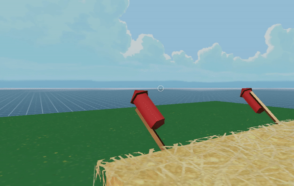

# Fireworks-MessageBus

A simple scene where players can light up fireworks, and all other players see them light up too.



This scene shows you:
- How to keep players synced by using the messagebus to communicate each player's actions to others
- How to play sounds from files
- How to encapsule a set of components into an object to easily reuse

## Try it out

**Install the CLI**

Download and install the Decentraland CLI by running the following command:

```bash
npm i -g decentraland
```

**Previewing the scene**

Download this example and navigate to its directory, then run:

```
$:  dcl start
```

Any dependencies are installed and then the CLI opens the scene in a new browser tab.

**Scene Usage**

Click on one of the firewarks to light it up!

If there are multiple players in the scene, they should all see them launch too. You can simulate this by opening two browser tabs with the same preview.

Learn more about how to build your own scenes in our [documentation](https://docs.decentraland.org/) site.

If something doesn’t work, please [file an issue](https://github.com/decentraland-scenes/Awesome-Repository/issues/new).

## Copyright info

This scene is protected with a standard Apache 2 licence. See the terms and conditions in the [LICENSE](/LICENSE) file.

